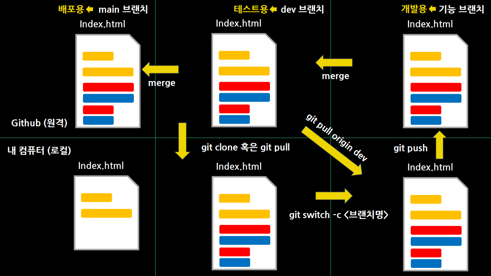

# 2025-02-24
## 내일배움캠프 6일차 TIL

### [ 프로젝트 팀 변경 ]

### 1. 프로그래밍 기초 주차

본격적인 Java 문법 수강이 시작되었다.  
대부분 알고있는 개념이지만 정확하게 설명할순 없을정도라 다시한번 잡고간다  
생각하고 개념적인 부분을 잘 숙지하고 넘어가고싶다.

인터넷 강의형식으로 진행되고 Java의 완전한 기초부터 학습한다.  

### 챕터 1 자바 기초 문법 다지기 ( 1- 10 까지 )
챕터 1-1  : Hello Java!  
- intelliJ 설치 후, Java 프로그래밍 환경구성  
  
챕터 1-2  : 컴퓨터의 기억 방식  
- 주기억장치, 보조기억장치 등 컴퓨터 기억장치, 장치 구조

챕터 1-3  : 자바 프로젝트 관리  
- intelliJ 프로젝트 생성

챕터 1-4  : 변수 - 데이터의 저장 공간  
- 자료형 강의

챕터 1-5  : 입출력 - 프로그램과 사용자 간의 대화  
- Scanner 객체 생성 및 사용

#### 현재 1-5 까지 수강했다.
> 아직까진 누군가에게 구체적으로 설명하기 어려운 부분이 나오지 않고있기 때문에 .. 별다른 어려움은 없다.  
> 강의 수강 후 프로젝트는 계산기 구현으로 나온다고 한다.

### 특강 - Git 사용법 2차
 - Branch, Pull Request, Merge
> 이제 Branch 덕분에 여러 사람들이 함께 파일을 관리하더라도  
> 어느정도 충돌을 줄일 수 있는 Branch에 대해서 강의가 있었다.

#### Branch
> 코드의 독립적인 작업공간, 기존코드(main)을 유지하고 별도의 공간에서 작업할 수 있도록 만듦
- 기존 코드와 분리하여 작업 가능 
- 여러 개발자의 동시 작업을 위한 기능
- 필요할 때만 main(dev) Branch에 반영

#### Pull Request(PR)
> 협업 플랫폼에서 코드 변경사항을 main(dev) Branch에 반영해도 되는지 요청하는 것  
> 단순한 병합이 아닌 코드 리뷰를 거쳐 수정이 필요한 부분을 개선한 후 Merge
- 팀원에 코드 리뷰 요청 (피드백 반영 가능)
- 실수로 인한 잘못된 소스로 main(dev) Branch 반영을 방지
- 승인 후 main(dev) Branch에 병합
  
#### Merge
> 다른 Branch에서 작업한 내용을 기존 Branch에 합치는 과정  
> feature Branch에서 작업 후 main(dev) Branch에 반영할 때 사용
- 개별(feature) Branch에서 개발한 기능을 main(dev)에 통합
- 팀원들이 개발한 코드와 병합하여 프로젝트 진행
- 충돌이 발생하면 해결 후 병합해야함!

### 전체적인 흐름  
### 1. Branch 생성, 작업 및 커밋
### 2. Pull Request 생성 - 코드리뷰, 피드백 반영
### 3. Merge 병합 - 코드 승인 시 main(dev) Branch 병합
### 4. feature Branch 삭제(선택사항)

> Branch를 활용하여 기능단위의 개발을 진행할 수 있다!  
> 이전에 팀 소개 프로젝트에서 Index.html, top.html, mid.html, bottom.
> html 등 각 그룹별로 맡은 파트만 수정하고, 마지막에 Index.html에 합치는
> 작업을 진행했었는데 이제는 Branch로 보다 더 간단하게 진행할 수 
> 있게되었다.

#### 이러한 협업 과정을 경험해보기 위해 신청한 교육이다보니 쓰이는용어는 익숙하지만 실제로 사용해본 경험이 거의 없을 정도여서 실제로 여러번 사용해서 실 사용에 익숙해지는것에 목표를 두고있다.
- 첫 프로젝트에 많이 소통하고, 어느정도 친분이 쌓인 교육생분과 함께 서로 Repository를 생성하고, Branch를 만들어 PR도 직접 해보았다. 많이 감사하다.

### Branch 활용 시 작업 순서

### [ 포트폴리오 - 내용 그대로]

## 웹
기존에 사용하던 OCI DB서버를 그대로 사용하고, 새로 만들어질 사이트는 현재 포트폴리오가 올라와있는 곳에서 올려보려한다.  
TS를 강의를 통해서 배우긴했지만, 막상 사용해보려하니 까다롭고 번거롭긴하다.  Vite를 이용한 React 프로젝트를 진행하려고 한다.

Vite를 이용한 React + TS 프론트, SpringBoot, MariaDB 백엔드

## 코테
프로그래머스를 꾸준히 한시간씩은 풀어보려한다.  
( 02-24 : 깜빡했다. 내일부터 하겠다.. 진행표가 필요할거같다. )

## TIL

## Tomorrow

1주차 강의 나머지 수강, 프로그래머스 문제풀기