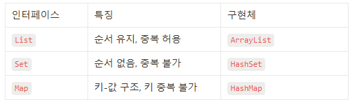

# 2025-02-27
## 내일배움캠프 9일차 TIL

### [ 프로젝트 팀 변경 ]

### 1. 프로그래밍 기초 주차

### 챕터 2 객체지향 이해하기 ( 1- 10 까지 )

챕터 3-1  : 예외(Exception)과 예외처리(try-catch)
- 예외(exception), 예외처리(try-catch), 예외종류(체크예외, 언체크예외)

챕터 3-2  : Optional - Null 을 다루는 법
- Optional (NULL 을 안전하게 처리하기 위해 활용되는 객체)
<details>

<summary>
( 상세보기 ) 직접적인 null 처리방법, Optional 객체 활용 방법
</summary>

```java

/*********************************
 * 직접적인 null 처리방법
********************************/
String studentName;
if(student != null){
    studentName = student.getName();
}
else {
    System.out.println("등록학생 아님");
}
```

```java
/*********************************
 * Optional 객체를 활용한 null 처리방법
********************************/
Optional<Student> studentOptional = camp.getStudent();
boolean flag = studentOptional.isPresent();

if(flag){
    Student student = studentOptional.get();
    String studentName = student.getName();
    camp.setStudent(steve);
}
// isPresent() 를 사용하지 않고 print를 하더라도 null로 나오고 오류를 뱉지는 않음
```
</details>

챕터 3-3  : 컬렉션(Collection)
- (List) ArrayList , (Set) HashSet, (Map) HashMap
<details>

<summary>
(상세설명) Collection의 자료구조
</summary>

1. 배열과 다르게 컬렉션의 길이(크기)는 가변적이다.
2. 데이터 저장, 조회, 삭제 등 다양한 기능을 간편하게 구현.


컬렉션의 종류와 특징

</details>

챕터 3-4  : 제네릭(Generic)
- 타입을 미리 지정하지 않고 사용 시점에 결정
<details>

<summary>
( 상세보기 ) Generic, 타입매개변수<T>
</summary>

1. Generic을 활용하면 **코드 재사용성**, **타입 안정성**을 보장받을 수 있다.
2. 과도하게 사용하면 오히려 복잡!


**GenericBox 클래스**
```java
public class GenericBox<T> {
    //속성
    private T item;

    //생성자
    public GenericBox(T item) {
        this.item = item;

    }

    //기능
    public T getItem() {
        return this.item;
    }
    // 일반 메서드
    public void printItem(T item) {
        System.out.println(item);
    }
    //제네릭 메서드
    public <S> void printBoxItem(S item){
        System.out.println(item);
    }
}
```

**Generic 활용**
```java
//제네릭 활용
//1. 재사용성 보장(타입 소거 : T -> Object)
GenericBox<String> strGBox = new GenericBox<String>("ABC");
GenericBox<Integer> intGBox = new GenericBox<Integer>(123);
GenericBox<Double> doubleGBox = new GenericBox<Double>(0.1);

//2. 타입 안정성 보장(타입 소거 : 자동으로 downcasting 삽입)
String strGBoxItem = strGBox.getItem();
System.out.println(strGBoxItem);
Integer intGBoxItem = intGBox.getItem();
System.out.println(intGBoxItem);
Double doubleGBoxItem = doubleGBox.getItem();
System.out.println(doubleGBoxItem);


//일반 메서드, 생성시에 선언한걸로 소거가 일어나서 정해져있음
strGBox.printItem("ABD"); // 컴파일 될때 downcasting 되어있음.
//strGBox.printItem(123); //  오류남
//strGBox.printItem(0.1); //  오류남

strGBox.printBoxItem("ABC");
strGBox.printBoxItem(100);
strGBox.printBoxItem(0.1);
```

Generic Class는 클래스 선언부에 <T> 가 선언된 클래스(재사용성 + 타입안정성)
> 타입소거  
> 컴파일 시점에 제네릭 타입 정보를 제거하는 과정  
> <T>타입 매개변수 부분은 Object로 대체  
> 필요한 경우 컴파일러가 강제로 DownCasting코드를 삽입  


Generic Method는 메소드 내부에서 사용할 타입을 유연하게 지정하는 기능  
메서드 선언부에 <T>가 선언된 메서드  
클래스제네릭 타입과 별개로 독립적인 타입 매개변수를 가짐
> 위 예제의 StrGBox.printBoxItem 부분이 제네릭 메소드 활용부분!

```java
// ⚠️ 일반 메서드 T item 는 클래스의 <T> 를 따라갑니다.
public void printItem(T item) {
    System.out.println(item);
}

// ✅ 제네릭 메서드 <S> 는 <T> 와 별개로 독립적이다.
public <S> void printBoxItem(S item) { 
    System.out.println(item);
}
```


</details>


#### 현재 3-4 까지 수강했다.
> 예외처리, Collection, Generic 일하면서, 지나오면서 한번씩은 다 봤던것들이지만 무엇이다. 라고 설명할 수 없는 처지였는데 이제 정확하게 알아서 찝찝하지도 않고 기분도 좋다. 매일 열심히 배우고 있다.


### 2. 개인 프로젝트 - Java 계산기 만들기

## ※ 필수 기능

## 1. Class를 사용하지 않는 계산기
> Class를 사용하지 않고, 자바의 기본 문법만을 사용하여 계산기를 구현

## 2. Class를 활용한 계산기
> Class를 정의하고, 연산을 수행하는 메소드를 작성, 자바의 객체지향 원칙을 적용한 계산기를 구현


## 3. 요구사항
1. 기본적인 사칙연산
2. 콘솔기반
3. 예외처리
4. 무한 반복(exit 입력 시 종료)
5. 연산 결과를 저장

## ※ 도전 기능
Enum, Generic, Lambda & Stream 기능


### 먼저 Class를 사용하지 않는 계산기를 만든 후 기능을 분리하기로 했다.

### Class를 사용하기 않는 계산기 -- 완료

### Class를 사용하는 계산기 -- 오늘 완료했다.
#### Class를 사용하는 계산기의 요구사항  
 - 사칙연산을 수행 후, 결과값 반환 메서드 구현 & 연산 결과를 저장하는 컬렉션 타입 필드를 가진 Calculator 클래스를 생성
 - Lv 1에서 구현한 App 클래스의 main 메서드에 Calculator 클래스가 활용될 수 있도록 수정
 - App 클래스의 main 메서드에서 Calculator 클래스의 연산 결과를 저장하고 있는 컬렉션 필드에 직접 접근하지 못하도록 수정 (캡슐화) - Getter, Setter
 - Calculator 클래스에 저장된 연산 결과들 중 가장 먼저 저장된 데이터를 삭제하는 기능을 가진 메서드를 구현한 후 App 클래스의 main 메서드에 삭제 메서드가 활용될 수 있도록 수정

> Class를 사용하지 않는 계산기를 이미 만들었기때문에 일부 기능을 Class를 활용해서 다른 Class에서 계산하고, 저장하고, 불러오고, 삭제하는 기능은 시간이 별로 오래 걸리지 않았다. 내일중으로 검사를 한번쯤 .. 받아보는것도 괜찮을 것 같다.
> 강의 진도를 좀 나간 후 도전 기능도 구현해야겠다.

- 오늘 완료했다.  
> 기존에 만들어둔 기능을 Class로 나누어주고, 요구사항을 맞추는것이라 크게 어렵지 않았다.
> 주말 중으로 도전기능을 끝내고 평일에 GUI작업을 해보려한다.


## 트러블 슈팅
.


### [ 포트폴리오 - 내용 그대로]

## 웹
기존에 사용하던 OCI DB서버를 그대로 사용하고, 새로 만들어질 사이트는 현재 포트폴리오가 올라와있는 곳에서 올려보려한다.  
TS를 강의를 통해서 배우긴했지만, 막상 사용해보려하니 까다롭고 번거롭긴하다.  Vite를 이용한 React 프로젝트를 진행하려고 한다.

Vite를 이용한 React + TS 프론트, SpringBoot, MariaDB 백엔드

## 코테
프로그래머스를 꾸준히 한시간씩은 풀어보려한다.  
- 알고보니 예전에 Oracle SQL Lv5까지 문제를 풀었었다!  

> 캠프에서 프로그래머스 문제를 매일 푸는 시스템을 적용했다.  
> 하루에 한개씩 프로그래밍, SQL이다. 매일 출석체크를 꾸준히 하고 하다가 막히면 여기에 적어야겠다.

## TIL


## Tomorrow

3주차 강의 수강, 계산기 개선