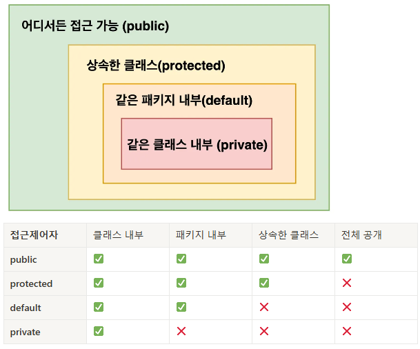

# 2025-02-27
## 내일배움캠프 9일차 TIL

### [ 프로젝트 팀 변경 ]

### 1. 프로그래밍 기초 주차

### 챕터 2 객체지향 이해하기 ( 1- 10 까지 )

챕터 2-7  : 객체지향 PART 1 - 캡슐화(접근제어자)
- public, private, getter, setter, 데이터의 보호
<details>

<summary>
접근제어자 그림, 표
</summary>

  

</details>
  
챕터 2-8  : 객체지향 PART 2 - 상속
- Inheritance 상속, Super 부모 인스턴스 생성자
- Overriding 오버라이딩 , Abstract 추상클래스  
<details>

<summary>
상속 소스 설명
</summary>

```java
/************************
 * 부모 클래스
 ************************/
public class Parent {
    public String parentName = "부모"
}
```
```java

/************************
 * 부모 클래스
 ************************/
public class Child extends Parent {
    public String childName = "자식"
}
```
```java

/************************
 * 메인
 ************************/
public class Main {
    public static void main(String[] args){
        Child child = new Child();
        System.out.println(child.parentName); // ✅ 사용가능!!
    }
}
```

</details>

챕터 2-9  : 객체지향 PART 3 - 추상화
- 추상 계층 표현(인터페이스 및 클래스 상속 활용)

<details>

<summary>추상화 소스 설명</summary>

```java
public interface Earth {
    void earth(); // ✅ 공통 : 지구에 있다.
}
```

```java
public interface Life extends Earth {

    void breath(); //✅ 공통 : 생명체는 숨을 쉰다.
}
```

```java
public class Cat implements Animal {

    @Override
    public void earth() {
        System.out.println("고양이가 지구에 있습니다.");

    }

    @Override
    public void breath() {
        System.out.println("고양이가 숨을 쉽니다.");
    }

    public void scratch() {
        System.out.println("고양이가 할큅니다.");
    }
}
```

```java
public class Main {

    public static void main(String[] args) {
        Cat cat = new Cat();
        cat.earth();
        cat.breath();
        cat.scratch();
    }
}
```

</details>

챕터 2-10  : 객체지향 PART 4 - 다형성
- Polymorphism 다형성, 업캐스팅, 다운캐스팅

<details>

<summary>다형성 사진과 소스 설명</summary>


```java
public class Main {

    public static void main(String[] args) {

        // 다형성 활용
        Animal animal = new Cat();      //형변환(Casting) 발생
        animal.exist(); // ✅
        animal.makeSound(); // ✅
    }
}
```
- 자식타입 → 부모타입: UpCasting
- 부모타입 → 자식타입: DownCasting

> UpCasting
- 데이터를 다를 수 있지만 자식 클래스 고유기능 활용 불가 (다운캐스팅 필요)

> DownCasting
```java
public class Main {

    public static void main(String[] args) {
        // 다운 캐스팅
        Animal dog = new Dog();
        // 문법적으로 잘못된건 아니라서 에러 발생 X
        Cat cat1 = (Cat) dog; // ⚠️ 
        cat1.scratch(); // ❌ 해당 라인이 실행될때만 에러
    }
}
```
다운 캐스팅엔 instanceof 활용필요
```java
Animal animal2 = new Dog();

// ✅ 안전한 다운캐스팅(animal2 가 Cat 의 인스턴스 유형인지 확인합니다.)
if (animal2 instanceof Cat) {
    Cat cat = (Cat) animal2;
    cat.scratch();
} else {
    System.out.println("객체가 고양이가 아닙니다.");
}
```

</details>

#### 현재 2-10 까지 수강했다.
> 2-6 부터는 정말 프레임워크를 쓰면서 느낌으로만 알고있던 단어들이다.  
> 내가 이렇게 몰랐나하는 충격도 좀 많이 들었다.  
> 그래서인지 더 열심히 들었다.  
> 사실 게터나 세터도 롬복으로 편하게 추가했었으니 ...계속 열심히 들어야겠다.


### 2. 개인 프로젝트 - Java 계산기 만들기

## ※ 필수 기능

## 1. Class를 사용하지 않는 계산기
> Class를 사용하지 않고, 자바의 기본 문법만을 사용하여 계산기를 구현

## 2. Class를 활용한 계산기
> Class를 정의하고, 연산을 수행하는 메소드를 작성, 자바의 객체지향 원칙을 적용한 계산기를 구현


## 3. 요구사항
1. 기본적인 사칙연산
2. 콘솔기반
3. 예외처리
4. 무한 반복(exit 입력 시 종료)
5. 연산 결과를 저장

## ※ 도전 기능
Enum, Generic, Lambda & Stream 기능


### 먼저 Class를 사용하지 않는 계산기를 만든 후 기능을 분리하기로 했다.

### Class를 사용하기 않는 계산기 -- 완료

### Class를 사용하는 계산기 -- 오늘 완료했다.
#### Class를 사용하는 계산기의 요구사항  
 - 사칙연산을 수행 후, 결과값 반환 메서드 구현 & 연산 결과를 저장하는 컬렉션 타입 필드를 가진 Calculator 클래스를 생성
 - Lv 1에서 구현한 App 클래스의 main 메서드에 Calculator 클래스가 활용될 수 있도록 수정
 - App 클래스의 main 메서드에서 Calculator 클래스의 연산 결과를 저장하고 있는 컬렉션 필드에 직접 접근하지 못하도록 수정 (캡슐화) - Getter, Setter
 - Calculator 클래스에 저장된 연산 결과들 중 가장 먼저 저장된 데이터를 삭제하는 기능을 가진 메서드를 구현한 후 App 클래스의 main 메서드에 삭제 메서드가 활용될 수 있도록 수정

> Class를 사용하지 않는 계산기를 이미 만들었기때문에 일부 기능을 Class를 활용해서 다른 Class에서 계산하고, 저장하고, 불러오고, 삭제하는 기능은 시간이 별로 오래 걸리지 않았다. 내일중으로 검사를 한번쯤 .. 받아보는것도 괜찮을 것 같다.


## 트러블 슈팅
.


### [ 포트폴리오 - 내용 그대로]

## 웹
기존에 사용하던 OCI DB서버를 그대로 사용하고, 새로 만들어질 사이트는 현재 포트폴리오가 올라와있는 곳에서 올려보려한다.  
TS를 강의를 통해서 배우긴했지만, 막상 사용해보려하니 까다롭고 번거롭긴하다.  Vite를 이용한 React 프로젝트를 진행하려고 한다.

Vite를 이용한 React + TS 프론트, SpringBoot, MariaDB 백엔드

## 코테
프로그래머스를 꾸준히 한시간씩은 풀어보려한다.  
- 알고보니 예전에 Oracle SQL Lv5까지 문제를 풀었었다!  
  
( 02-24 : 깜빡했다. 내일부터 하겠다.. 진행표가 필요할거같다. )  
( 02-25 : 깜빡했다. 내일부터 하겠다.. 진행표가 필요할거같다. ) * 2  
( 02-26 : Lv0, Java를 1번부터 풀고있다. 사실 한시간은 못했고 20개 풀었다.)  
( 02-27 : Lv0, 하루에 열개씩... 으로 하려고한다 현재 30)  


## TIL


## Tomorrow

2주차 강의 나머지 수강, Class를 사용한 계산기 구현, 프로그래머스 문제풀기