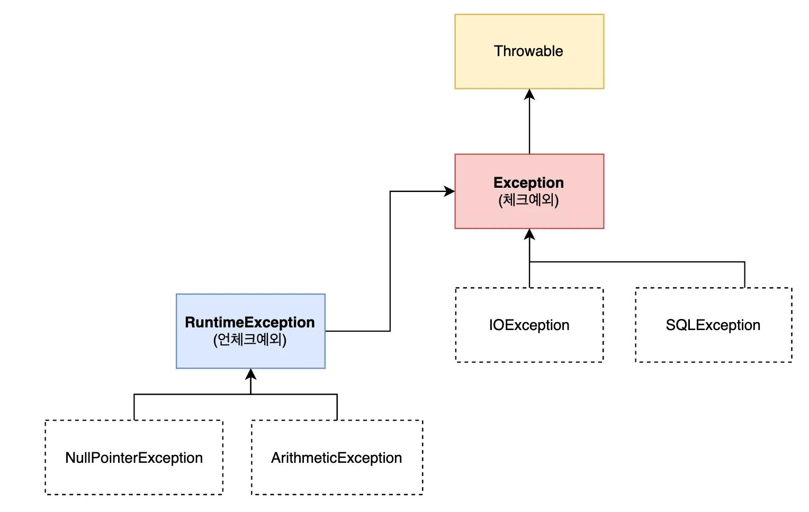

# 2025-03-04
## 내일배움캠프 11일차 TIL

### [ 프로젝트 팀 변경 ]

### 1. 프로그래밍 기초 주차

### 챕터 3 자바 개념 확장 ( 1 - 7 까지 )

챕터 3-1  : 예외(Exception)와 예외처리(try-catch)
- 

(상세설명) 

RuntimeException - UncheckedException  
- 예외처리를 컴파일러가 확인하지 않음  
- RuntimeException을 상속받는 모든 예외(UncheckedException)

Exception - CheckedException  
- 예외처리를 컴파일러가 확인
- Exception을 상속받는 모든 예외(CheckedException)

throws  
- throws 키워드를 사용하여 예외를 호출한 곳에서 처리하도록 강제하는 방식

**프로그램이 예기치않은 오류로 강제종료 되는것을 막고자하는 것**

챕터 3-2  : Optional - null 을 다루는 법
- 

(상세설명) 

챕터 3-3  : 컬렉션(Collection)
- 

(상세설명)

챕터 3-4  : 제네릭(Generic)
- 

(상세설명)

챕터 3-5  : 람다(Lambda)
- 

(상세설명)

챕터 3-6  : 스트림(Stream)
- 

(상세설명)

챕터 3-7  : 쓰레드(Thread)
- 

(상세설명)

  

#### 주말동안 3주차 모두 수강했다.
> 자바의 완전히 처음부터 끝까지 다 느껴볼 수 있는 기회였고, 익힌것을 토대로 제대로 된 계산기를 만들어보고 싶어졌다.

### 2. 개인 프로젝트 - Java 계산기 만들기

## ※ 필수 기능

## 1. Class를 사용하지 않는 계산기
> Class를 사용하지 않고, 자바의 기본 문법만을 사용하여 계산기를 구현

## 2. Class를 활용한 계산기
> Class를 정의하고, 연산을 수행하는 메소드를 작성, 자바의 객체지향 원칙을 적용한 계산기를 구현

## 3. 요구사항
1. 기본적인 사칙연산
2. 콘솔기반
3. 예외처리
4. 무한 반복(exit 입력 시 종료)
5. 연산 결과를 저장  
++ 도전기능

## ※ 도전 기능
Enum, Generic, Lambda & Stream 기능

### 먼저 Class를 사용하지 않는 계산기를 만든 후 기능을 분리하기로 했다.

### Class를 사용하기 않는 계산기 -- 완료

### Class를 사용하는 계산기 -- 완료

### 도전 기능

## 트러블 슈팅
.

### [ 포트폴리오 - 내용 그대로]

## 웹
기존에 사용하던 OCI DB서버를 그대로 사용하고, 새로 만들어질 사이트는 현재 포트폴리오가 올라와있는 곳에서 올려보려한다.  
TS를 강의를 통해서 배우긴했지만, 막상 사용해보려하니 까다롭고 번거롭긴하다.  Vite를 이용한 React 프로젝트를 진행하려고 한다.

Vite를 이용한 React + TS 프론트, SpringBoot, MariaDB 백엔드

## 코테
프로그래머스를 꾸준히 한시간씩은 풀어보려한다.  
- 알고보니 예전에 Oracle SQL Lv5까지 문제를 풀었었다!  
 
교육에서 모든 인원이 매일 오전 1시간씩 프로그래머스 문제 풀이를 진행한다.  
JAVA, SQL 한문제씩 진행하는데, 꾸준히 진행하려고 한다.

## TIL

## Tomorrow

계산기 완료