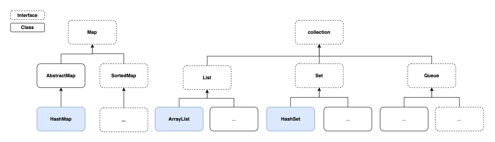

# 2025-03-04
## 내일배움캠프 11일차 TIL

### [ 프로젝트 팀 변경 ]

### 1. 프로그래밍 기초 주차

### 챕터 3 자바 개념 확장 ( 1 - 7 까지 )

챕터 3-1  : 예외(Exception)와 예외처리(try-catch)
- 
<details>
<summary>
(상세설명) 예외처리의 종류
</summary>


RuntimeException - UncheckedException  
- 예외처리를 컴파일러가 확인하지 않음  
- RuntimeException을 상속받는 모든 예외(UncheckedException)

Exception - CheckedException  
- 예외처리를 컴파일러가 확인
- Exception을 상속받는 모든 예외(CheckedException)

throws  
- throws 키워드를 사용하여 예외를 호출한 곳에서 처리하도록 강제하는 방식

**프로그램이 예기치않은 오류로 강제종료 되는것을 막고자하는 것**
</details>

챕터 3-2  : Optional - null 을 다루는 법
- 
<details>
<summary>
(상세설명) null 을 안전하게 처리하기 위해서 활용되는 객체
</summary>

1. Optional 객체는 값이 있을 수도 없을 수도 있는 객체  
2. Optional.ofNullable() 을 사용하여 null 이 반환될 수 있는 객체를 관리  
3. isPresent() 와 같은 OptionalAPI를 통해 안전하게 null을 처리  

> isPresent : Optional 내부의 값이 존재할 경우 true 반환, 내부 값이 null인 경우 false 반환  
> orElseGet : 값이 없을 때만 기본값을 제공하는 로직을 실행하는 **메서드** (람다사용)


</details>

챕터 3-3  : 컬렉션(Collection)
- 
<details>
<summary>
(상세설명) 인터페이스와 구현체를 제공하는 집합
</summary>




| 인터페이스 | 특징 | 구현체 |
| --- | --- | --- |
| `List`  | 순서 유지, 중복 허용 | `ArrayList` |
| `Set`  | 순서 없음, 중복 불가 | `HashSet` |
| `Map`  | 키-값 구조, 키 중복 불가 | `HashMap` |


**배열과 다르게 컬렉션은 길이가 가변적**

</details>

챕터 3-4  : 제네릭(Generic)
- 
<details>
<summary>
(상세설명) 타입을 미리 지정하지 않고 사용 시점에 결정할 수 있음
</summary>

- 제네릭 - 타입을 미리 지정하지 않고 사용 시점에 유연하게 결정할 수 있는 문법
- 타입 소거: 컴파일 시점에 제네릭 타입 정보를 제거하는 과정
- 제네릭 클래스 - 클래스 선언 시 `<T> 타입매개변수`를 사용해 다양한 데이터 타입을 안전하게 처리할 수 있는 구조
- 제네릭 메서드 - 클래스의 타입 매개변수와 별개로 독립적인 타입 매개변수를 가진 메서드

> 특정 타입(Integer 등)으로 고정 되어 있으면 재사용이 어려움.
- 다른 타입이 필요하면 새로 만들어야함(형변환 필요 -> 오류 가능성 증가)
> 제네릭 `<T>`(타입매개변수)  
- 타입을 의미하는 자리(실제 데이터 타입으로 대체되어 활용)
> 타입소거(컴파일 시점에 제네릭 타입 정보를 제거하는 과정)
- 필요한 경우 컴파일러가 **자동으로 다운 캐스팅하여 타입 안전성 보장**
> 제네릭 메서드(메서드 내부에서 사용할 타입을 지정하는 기능)
- 메서드 선언부에 `<T>` 가 선언된 메서드
- 제네릭 메서드는 클래스 제네릭 타입과 별개로 **독립적인 타입 매개변수**를 가짐

활용 예시

```java
//class GenericBox

public class GenericBox<T> {
    //속성
    private T item;

    //생성자
    public GenericBox(T item) {
        this.item = item;

    }

    //기능
    public T getItem() {
        return this.item;
    }
    // 일반 메서드
    public void printItem(T item) {
        System.out.println(item);
    }
    //제네릭 메서드
    public <S> void printBoxItem(S item){
        System.out.println(item);
    }
}
```

```java
//Main

//제네릭 활용
        //1. 재사용성 보장(타입 소거 : T -> Object)
        GenericBox<String> strGBox = new GenericBox<String>("ABC");
        GenericBox<Integer> intGBox = new GenericBox<Integer>(123);
        GenericBox<Double> doubleGBox = new GenericBox<Double>(0.1);

        //2. 타입 안정성 보장(타입 소거 : 자동으로 downcasting 삽입)
        String strGBoxItem = strGBox.getItem();
        System.out.println(strGBoxItem);
        Integer intGBoxItem = intGBox.getItem();
        System.out.println(intGBoxItem);
        Double doubleGBoxItem = doubleGBox.getItem();
        System.out.println(doubleGBoxItem);


        //일반 메서드, 생성시에 선언한걸로 소거가 일어나서 정해져있음
        strGBox.printItem("ABD"); // 컴파일 될때 downcasting 되어있음.
//        strGBox.printItem(123); //  오류남
//        strGBox.printItem(0.1); //  오류남

        strGBox.printBoxItem("ABC");
        strGBox.printBoxItem(100);
        strGBox.printBoxItem(0.1);
```

</details>

챕터 3-5  : 람다(Lambda)
- 
<details>
<summary>
(상세설명)
</summary>

- 익명 클래스 - 별도의 클래스 파일을 만들지 않고 코드 내에서 일회성으로 정의해 사용하는 클래스
- 함수형 인터페이스 - 단 하나의 추상 메서드만 가지도록 강제되어 람다식에 - 활용되는 인터페이스
- 람다식 - 익명 클래스를 간결하게 표현하는 문법

**람다식을 활용할때는 꼭 함수형 인터페이스를 활용**

**오버로딩과 오버라이딩의 차이**

- **오버로딩**은 같은 클래스나 인터페이스 내에서 **동일한 메서드 이름**을 사용해서 선언하는 기능   
→  매개변수의 개수나 타입, 순서는 다르게 선언해야함
- **오버라이딩**은 부모 클래스에 정의된 메서드를 자식 클래스에서 재정의

```java
//Calculator Interface
@FunctionalInterface        //함수형 인터페이스선언
public interface Calculator {

    int sum(int a, int b); //오직 하나의 추상 메서드만 선언해야함

//    int sum(int a, int b, int c); // 선언불가 에러발생
}
```

```java
//Calculator Class
public class Calculator1 implements Calculator{
    @Override
    public int sum(int a, int b) {
        return a+b;
    }
}
```

```java
//Main

public class Main {

    public static void main(String[] args) {
        //  인터페이스를 활용한 익명 클래스 만들기
        Calculator calculator1 = new Calculator() {

            @Override
            public int sum(int a, int b) {
                return a + b;
            }
        };
        int ret1 = calculator1.sum(2, 3);
        System.out.println(ret1);

        //인터페이스를 활용한 람다식 만들기
        Calculator calculator2 = (a, b) -> a + b;
        int ret2 = calculator2.sum(3, 3);
        System.out.println(ret2);

        //람다식을 매개변수로 전달하는 방법
        //1. 익명클래스를 변수에 담아 매개변수로 전달
        Calculator cal1 = new Calculator() {
            @Override
            public int sum(int a, int b) {
                return a+b;
            }
        };

        int ret3 = calculate(3,3,cal1);
        System.out.println("ret3 = " + ret3);

        //2. 람다식을 변수에 담아 매개변수로 전달
        Calculator cal2 = (a,b) -> a + b;
        int ret4 = calculate(4,4,cal2);
        System.out.println("ret4 = " + ret4);

        //3. 람다식을 직접 매개변수로 전달
        int ret5 = calculate(5,5,(a,b) -> a + b);
        System.out.println("ret5 = " + ret5);

    }
    public static int calculate(int a, int b, Calculator calculator){
        return calculator.sum(a,b);
    }
}
```

</details>

챕터 3-6  : 스트림(Stream)
- 
<details>
<summary>
(상세설명) 데이터를 효율적으로 처리할 수 있는 흐름
</summary>

- map - 각 요소를 변환하는 중간 연산 중 하나
- filter - 조건에 맞는 요소만 걸러내는 중간 연산 중 하나

| 단계 | 설명 | 주요 API |
| --- | --- | --- |
| **1. 데이터 준비** | 컬렉션을 스트림으로 변환 | `stream()`, `parallelStream()` |
| **2. 중간 연산 등록
(즉시 실행되지 않음)** | 데이터 변환 및 필터링 | `map()`, `filter()`, `sorted()` |
| **3. 최종 연산** | 최종 처리 및 데이터 변환 | `collect()`, `forEach()`, `count()` |

```java
// 1. 익명 클래스를 직접 만들어서 변수에 담아 매개변수로 전달
Function<Integer, Integer> function = new Function<Integer, Integer>() {
    @Override
    public Integer apply(Integer integer) {
        return integer * 10;
    }
};

List<Integer> ret4 = arrayList.stream()
        .map(function)
        .collect(Collectors.toUnmodifiableList());
System.out.println("ret4 = " + ret4);
System.out.println("Stream ret4----------------------");

//2. 람다식을 만들어서 변수에 담아 매개변수로 전달
Function<Integer, Integer> functionLambda = (i -> i * 10);
List<Integer> ret5 = arrayList.stream()
        .map(functionLambda)
        .collect(Collectors.toUnmodifiableList());
System.out.println("ret5 = " + ret5);
System.out.println("Stream ret5----------------------");

//3. 람다식을 직접 매개변수로 전달
List<Integer> ret6 = arrayList.stream()
        .map(num -> num * 10)
        .collect(Collectors.toUnmodifiableList());
System.out.println("ret6 = " + ret6);
System.out.println("Stream ret6----------------------");

//4. 중간 연산을 함께 사용하는 방법(filter() + map())
// 요구사항 : List에서 짝수를 찾아서 * 10
// - 1. 짝수 찾기
// - 2. * 10
List<Integer> ret7 = arrayList.stream()
        .filter(i -> i % 2 == 0)
        .map(i -> i * 10)
        .collect(Collectors.toUnmodifiableList()); // 1. 데이터 흐름 준비(1,2,3,4)
System.out.println(ret7);
```

</details>

챕터 3-7  : 쓰레드(Thread)
- 
<details>
<summary>
(상세설명) 프로그램 내에서 독립적으로 실행되는 작은 실행 단위
</summary>

- 싱글 쓰레드 - 하나의 작업을 순차적으로 처리하는 실행 방식
- 멀티 쓰레드 - 여러 작업을 동시에 처리하는 실행 방식

> `쓰레드` 프로그램 내에서 독립적으로 실행되는 하나의 작업 단위  
> `싱글 쓰레드` 한 번에 하나의 작업만 처리 `멀티쓰레드`는 여러 작업 동시 처리  
> `멀티 쓰레드` 활용하면 여러 작업을 병렬로 수행할 수 있어 처리 성능 향상  
> `join()` 특정 쓰레드가 끝날 때까지 기다리기  
> `Runnable` 인터페이스 활용, 유지 보수성과 재사용성 향상  

</details>
  

#### 주말동안 3주차 모두 수강했다.
> 자바의 완전히 처음부터 끝까지 다 느껴볼 수 있는 기회였고, 익힌것을 토대로 제대로 된 계산기를 만들어보고 싶어졌다.  
> Generic, Stream은 다음에 몇번 더 보고, 활용해봐야겠다.


### 2. 개인 프로젝트 - Java 계산기 만들기

## ※ 필수 기능

## 1. Class를 사용하지 않는 계산기
> Class를 사용하지 않고, 자바의 기본 문법만을 사용하여 계산기를 구현

## 2. Class를 활용한 계산기
> Class를 정의하고, 연산을 수행하는 메소드를 작성, 자바의 객체지향 원칙을 적용한 계산기를 구현

## 3. 도전 기능 구현
> Enum, 제네릭, 람다 & 스트림을 이해한 계산기 만들기
> 실수, 즉 double 타입의 값을 전달 받아도 연산이 수행하도록 만들기
> 저장된 연산 결과들 중 Scanner로 입력받은 값보다 큰 결과값 들을 출력

## 4. 요구사항
1. 기본적인 사칙연산
2. 콘솔기반
3. 예외처리
4. 무한 반복(exit 입력 시 종료)
5. 연산 결과를 저장  
++ 도전기능

### 먼저 Class를 사용하지 않는 계산기를 만든 후 기능을 분리하기로 했다.

### Class를 사용하기 않는 계산기 -- 완료

### Class를 사용하는 계산기 -- 완료

### 도전 기능 -- 완료


## 트러블 슈팅
계산기 트러블 슈팅으로 따로 작성


### [ 포트폴리오 - 내용 그대로]

## 웹
기존에 사용하던 OCI DB서버를 그대로 사용하고, 새로 만들어질 사이트는 현재 포트폴리오가 올라와있는 곳에서 올려보려한다.  
TS를 강의를 통해서 배우긴했지만, 막상 사용해보려하니 까다롭고 번거롭긴하다.  Vite를 이용한 React 프로젝트를 진행하려고 한다.

Vite를 이용한 React + TS 프론트, SpringBoot, MariaDB 백엔드

## 코테
프로그래머스를 꾸준히 한시간씩은 풀어보려한다.  
- 알고보니 예전에 Oracle SQL Lv5까지 문제를 풀었었다!  
 
교육에서 모든 인원이 매일 오전 1시간씩 프로그래머스 문제 풀이를 진행한다.  
JAVA, SQL 한문제씩 진행하는데, 꾸준히 진행하려고 한다.

## TIL


## Tomorrow

도전 기능 구현 완료