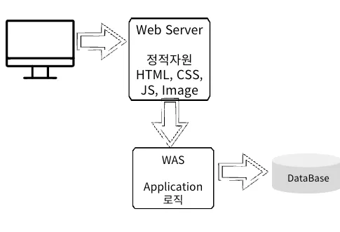
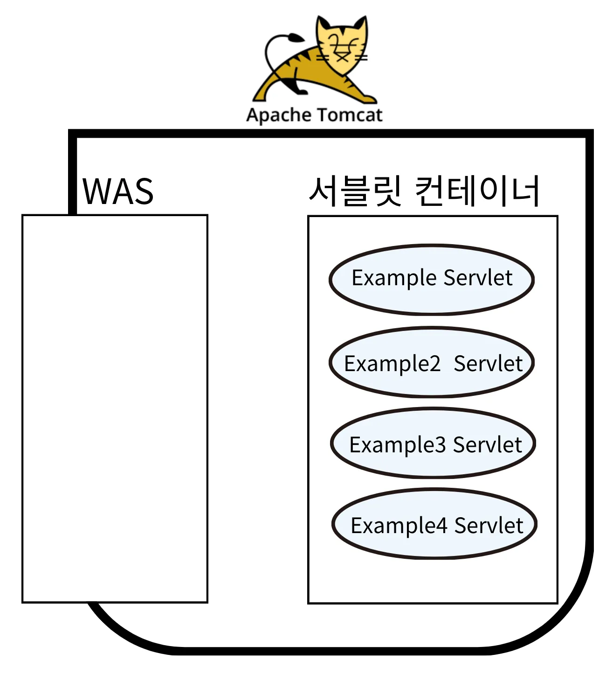
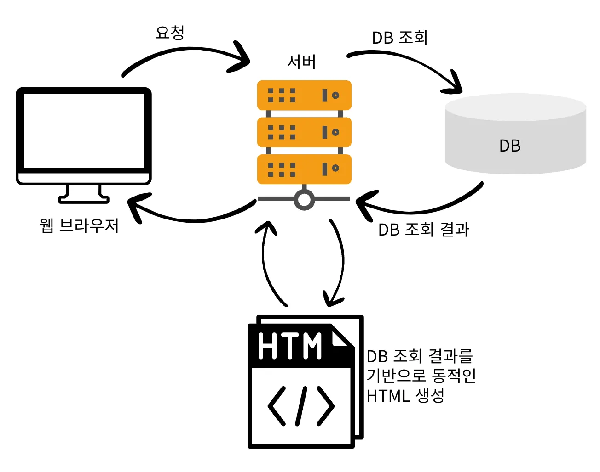
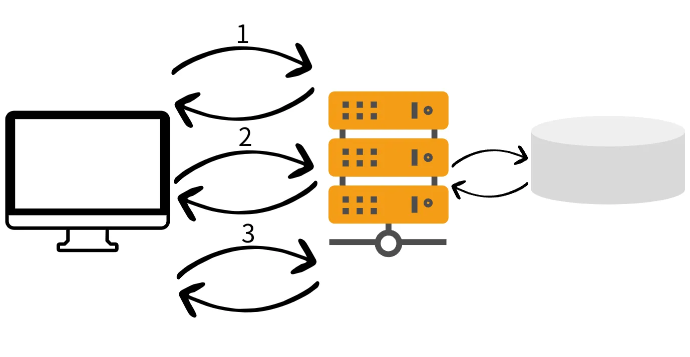

# 2025-03-18
## 내일배움캠프 21일차 TIL

### [ Spring 입문 ]

조가 바뀌고, Spring 강의가 시작되었다.  
네트워크에 대한 강의가 1주차에 편성되어있다.  

기초 Spring 1주차
1. 네트워크 (17일 수강완료)
2. Web기초 (17일 수강완료)
3. 용어 모음집 ★(17일 수강완료)
4. HTTP (17일 수강완료)
5. Web Application(18일 수강완료)

기초 Spring 2주차
1. 프레임워크, 라이브러리(18일 수강완료)
2. Annotation(18일 수강완료)
3. Spring Framework, Spring Boot(18일 수강완료)
4. 빌드 관리 도구(18일 수강완료)
5. Java 웹 기술의 역사(18일 수강완료)

<strong>1. Web Application 주요내용</strong>

1. `Web Server`
  - 웹 서버는 HTTP 기반으로 동작하며 정적 리소스(HTML, CSS, JS, 이미지 등)를 제공

  - 대표적인 Web Server
    - NGINX
    - Apache

2. `Web Application Server(WAS)`
  - HTTP 기반으로 동작하며 웹 서버의 기능을 포함한다. 추가적으로 코드를 실행해서 Application 로직을 수행하고 DB와 상호작용하여 동적 컨텐츠를 생성한다.
  
  - 대표적인 Web Application Server
  - Tomcat
  - Jetty
  - Undertow

**`Web Server`와 `WAS(Web Application Server)`의 차이점**  
- 실제로는 Web Server도 Application 로직을 포함할 수 있다.
- WAS는 Application 코드를 실행하는 것에 더욱 특화되어 있다.
- Java에서는 **Servlet Container** 기능을 제공하면 WAS 이다.  
  

3. **실제 웹 시스템 구성**

   - 정적 리소스는 Web Server에서 처리한다.
   - Web Server는 Application 로직이 필요한 요청만을 WAS에 전달한다.
   - 효율적 리소스 관리
     - 정적 자원을 많이 사용한다면 Web Server를 ScaleOut
     - Application 관련 자원이 많이 사용 된다면 WAS를 ScaleOut
     - 오류화면 제공
     - Web Server는 오류가 발생할 확률이 아주 낮다.
     - WAS는 오류가 발생할 확률이 아주 높고, 장애가 자주 발생
     - WAS는 DB와 상호작용 하기 때문에 DB에 문제가 생겨도 문제가 발생

4. Servlet
  - Servlet은 HTTP 프로토콜 기반 요청(Request) 및 응답(Response)을 처리하는데 사용
  - JAVA에서 Sevlet은 HttpServlet 클래스를 상속받아 구현되며, 웹 애플리케이션 개발의 핵심 기술 중 하나

  

     1. WAS는 HTTP 요청 메세지를 기반으로 새로운 Request, Response 객체 생성
     2. WAS는 만들어진 Request, Response 객체를 서블릿 컨테이너에 넘겨주며 ExampleServlet 객체 호출
     3. ExampleServlet에서 비지니스 로직 처리
     4. 응답에 필요한 정보를 개발자가 입력
     5. WAS는 Response 객체 정보(개발자가 입력한 정보)로 HTTP 응답 메세지 생성

5. Servlet Container
  - Servlet을 지원하는 WAS 내부에는 서블릿 컨테이너가 있다. 서블릿 컨테이너는 서블릿을 초기화, 생성, 관리, 호출, 종료하는 역할을 수행한다.

- Servlet의 생명주기
    - Servlet은 서블릿 컨테이너가 생성 및 관리한다.
    - WAS(서블릿 컨테이너 포함)가 종료될 때 Servlet도 함께 종료된다.

- Servlet 객체 생성시점
    - 개발자가 직접 인스턴스화 하여 사용하는것이 아닌, 코드만 작성하면 서블릿 컨테이너가 생성한다.

    

6. Thread
  - 애플리케이션 코드를 하나하나 순차적으로 실행하는 것, Java에서 main method를 실행하면 main이라는 이름을 가진 Thread가 실행되며 하나의 Thread는 한번에 하나의 코드 라인만 수행한다. 만약 동시 처리가 필요하다면 Thread를 추가적으로 생성 해야한다.
  - WAS는 동시 요청에 대한 처리를 위해 Multi Thread를 지원

   - 장점
     - 동시 요청을 처리할 수 있다.
     - 하나의 Thread에 지연등의 문제가 발생하여도 나머지 Thread는 정상적으로 동작한다.
   - 단점
     - Thread 생성에 제한이 없고 생성 비용이 높다.
         - 수많은 동시 요청이 발생하면 리소스(Memory, CPU 등)부족으로 서버가 다운된다.
     - Thread를 사용하면 `Context Switching(문맥교환)` 비용이 발생한다.

    **Multi Thread 환경이므로 싱글톤 객체(Servlet, Spring Bean)는 주의해서 사용**

7. SSR(Server Side Rendering)
  - 서버에서 동적으로 HTML을 만들어 클라이언트에게 제공하는 기술로 백엔드 개발자 영역에 속한다. Java에서는 JSP, Thymeleaf가 대표적으로 사용된다.

  

     1. 서버(WAS)에 HTML을 요청한다.
     2. 서버(WAS)에서 로직을 거친 후 DB를 조회한다.
     3. 조회 결과를 기반으로 HTML을 동적으로 생성한다.
     4. 생성된 HTML을 응답한다.

   - SSR의 장단점
    - 장점
        1. 초기 페이지 로드 시 서버에서 완전히 렌더링된 HTML을 반환하여 첫 페이지 로딩이 빠르다.
        2. 검색 엔진 크롤러가 완전한 HTML을 즉시 수집할 수 있어 `SEO`에 유리
        (SEO : 검색 엔진에서 상위 노출을 위해 최적화하는 과정)
                
    - 단점
        1. 모든 요청에 대해 서버가 페이지를 렌더링해야 하므로, 높은 트래픽 상황에서 서버의 부하가 크게 증가할 수 있다.
        2. 초기 페이지 이외의 페이지들도 렌더링 후 반환되기 때문에 속도가 느리다.

8. CSR(Client Side Rendering)
   - 웹 브라우저에서 자바스크립트를 사용해 동적으로 HTML을 생성해서 적용하는 기술로 웹을 모바일 앱 처럼 부분 부분 변경할 수 있게 해준다. 프론트엔드 개발자 영역에 속하는 React, Vue가 대표적으로 사용된다.

    

     1. HTML을 요청한다. 비어있는 HTML을 응답받는다. JS가 존재하는 주소 링크를 응답한다.
     2. 자바스크립트(클라이언트 로직, 렌더링 포함)를 요청한다.
     3. HTTP API 요청을 하고 화면에 필요한 데이터를 JSON 형태(JSON이 아니어도됨)로 응답받는다.
     4. 응답받은 JSON 데이터로 HTML을 동적으로 그린다.

   - CSR의 장단점
     - 장점
       1. 클라이언트 측에서 렌더링하므로 사용자 인터랙션(상호작용)에 빠르게 반응
       2. 초기 로딩 후에는 서버와의 통신 없이 빠르게 페이지 간 전환 가능

     - 단점
       1. 초기 로딩 시 필요한 모든 자바스크립트 파일을 다운로드하고 실행해야 하므로, 초기 로딩 시간이 길다.
       2. 검색 엔진 크롤러가 자바스크립트를 제대로 실행하지 못하면 SEO에 불리할 수 있다.

<strong>2. 프레임워크, 라이브러리</strong>

1. 프레임워크
  - 소프트웨어 개발을 간편하게 만들기 위한 소프트웨어 개발 환경
  - 애플리케이션을 개발할 때 전체적인 구조(frame)를 잡기 위해 사용하는 것
   - 기본적으로 프레임워크 내에서 사용하는 라이브러리들이 존재한다.
  - 장점
      - 개발 프로젝트에 일관된 구조를 제공하여 코드의 일관성과 가독성을 높여주며 팀 협업이 편해진다.
      - 기본적으로 필요한 기능과 도구를 제공하여 개발자들이 핵심 **비즈니스 로직**에 집중할 수 있다.
      - 보안 관련 기능을 기본적으로 제공하여, 보안 취약점을 방지하는 데 도움을 준다.
      - 통합된 테스트 환경과 도구를 제공하여 테스트를 쉽게 작성하고 실행할 수 있다.
      - 인기 있는 프레임워크는 방대한 커뮤니티 지원을 받으며, 다양한 문서를 활용할 수 있다.
   - 단점
     - 프레임워크는 굉장히 복잡한 구조를 가지기 때문에, 처음 익히는 데 시간이 많이 소요된다.
     - 프레임워크의 새로운 버전이 기존 코드와 호환되지 않을 수 있다.
     - 정해진 규칙과 구조를 따르게 강제하여 자유롭게 변경하기 어려울 수 있다.

2. 라이브러리
   - 애플리케이션 개발에 필요한 클래스, 함수 등을 모아 놓은 코드의 모음
   - 개발을 진행하는 과정에서 필요한 기능을 구현하기 위해 사용하는 것
  - 장점
      - 개발자가 복잡한 코드를 직접 작성하지 않아서 **개발 생산성**이 높아진다.
      - 검증된 라이브러리는 테스트와 커뮤니티 지원을 통해 안정성과 `품질이 보장된다.
   - 단점
     - 라이브러리가 업데이트 되거나 지원이 중단될 경우 문제가 발생할 수 있다.
     - 버전 호환성 문제로 인해 다른 라이브러리나 기존 코드와 **충돌이 발생**할 수 있습니다.
     - 생각보다 빈번하게 발생하는 문제
     - 불필요한 기능을 포함한 라이브러리를 사용하면 비효율적이다.
     - 라이브러리의 내부 구현을 직접 수정하기 어려워, 특정 요구 사항에 맞게 조정하기 힘들 수 있다.

<strong>3. Annotation</strong>

1. Annotation
  - 코드에 메타데이터를 추가할 수 있는 기능을 제공하며 주로 코드에 특별한 의미를 부여하거나, 컴파일러와 런타임에 특정 동작을 트리거하기 위해 사용

   - **내장 어노테이션**
     - **`@Override`**
         - 메서드가 상위 클래스나 인터페이스의 메서드를 오버라이드하고 있음을 나타낸다.
             - 이때 컴파일러는 메서드가 실제로 오버라이드하고 있는지 확인한다.
     - **`@Deprecated`**
       - 해당 요소가 더 이상 사용되지 않음을 나타낸다.
       - 해당 어노테이션이 붙은 코드를 사용하면 컴파일 경고가 발생한다.
     - **`@SuppressWarnings`**
       - 컴파일러 경고를 억제한다.
       - 사용되지 않는 변수에 대한 경고를 무시할 수 있다.

   - 개발자가 필요에 따라 직접 어노테이션을 정의할 수 있다.
   - 사용자 정의 어노테이션은 특정 메타데이터를 추가하거나,
   - **AOP**(Aspect-Oriented Programming) 같은 기술과 결합하여 다양한 기능을 구현할 수 있다.
  

- Lombok
  - 보일러 플레이트 코드를 줄여주는 라이브러리로 자동으로 보일러 플레이트 코드를 생성하여 코드의 가독성과 유지보수성을 높여준다. Lombok은 어노테이션 기반으로 동작하며, 주로 컴파일 시점에 소스 코드를 변환하여 필요한 메서드를 자동으로 생성  
  (보일러 플레이트 코드(Boilerplate code)
  getter/setter 메서드, 생성자, toString 메서드 등과 같이 반복적으로 작성되는 코드)

  | 어노테이션         | 설명 |
  |-------------------|--------------------------------------------|
  | `@Getter`        | 클래스의 필드에 대한 getter 메서드를 자동 생성 |
  | `@Setter`        | 클래스의 필드에 대한 setter 메서드를 자동 생성 |
  | `@ToString`      | `toString()` 메서드를 자동 생성 |
  | `@EqualsAndHashCode` | `equals()` 및 `hashCode()` 메서드를 자동 생성 |
  | `@NoArgsConstructor` | 매개변수가 없는 기본 생성자 자동 생성 |
  | `@AllArgsConstructor` | 모든 필드를 포함하는 생성자 자동 생성 |
  | `@RequiredArgsConstructor` | `final` 또는 `@NonNull` 필드만 포함한 생성자 자동 생성 |
  | `@Data`          | `@Getter`, `@Setter`, `@ToString`, `@EqualsAndHashCode`, `@RequiredArgsConstructor` 포함 |
  | `@Value`         | 불변 클래스 생성 (`@Getter`, `@ToString`, `@EqualsAndHashCode`, `@AllArgsConstructor`, `private final` 필드 적용) |
  | `@Builder`       | 빌더 패턴을 적용한 객체 생성 메서드 자동 생성 |
  | `@Slf4j`         | `SLF4J` 로거 필드(`private static final Logger log = LoggerFactory.getLogger(ClassName.class)`) 자동 생성 |

<strong>4. Spring Framework와 Spring Boot</strong>

1. Spring Framework
   - Java Application Framework로 엔터프라이즈 애플리케이션 개발에 주로 사용

2. **Spring Framework 특징**
   - 애플리케이션의 다양한 구성 요소를 유연하게 연결하고 관리할 수 있도록 해준다.
   - Spring Framework는 누구나 사용할 수 있는 오픈소스 이다.
   - 모듈화되어 있어 필요에 따라 특정 기능만 선택적으로 사용할 수 있다.
   - **Java언어의 가장 큰 특징인 객체 지향 언어의 특징을 살려낸 프레임워크**이다.
     - 캡슐화
     - 상속
     - 추상화
     - 다형성

3. Spring Boot
   - Spring Framework를 기반으로 하여 간편하고 신속하게 애플리케이션을 개발할 수 있도록 도와주는 도구

4. Spring Boot의 특징
    - **자동 구성**(Auto-configuration) 기능을 제공하여, 개발자가 복잡한 설정을 직접 처리할 필요 없이 기본 설정으로도 비즈니스 로직에 집중할 수 있게 해준다.
   - 내장 WAS(Tomcat)를 제공하여, 애플리케이션을 별도의 서버 설정 없이 바로 실행 가능
   - `spring-boot-starter-web`를 **빌드 관리 도구**에 추가하면 웹 애플리케이션에 필요한 모든 종속성과 설정이 자동으로 구성된다.
   - 라이브러리들의 버전을 명시하지 않아도 **호환 가능한 버전들을 찾아 자동으로 설정**

<strong>5. 빌드 관리(자동화) 도구</strong>

| 항목           | Gradle | Maven |
|--------------|--------|-------|
| **빌드 스크립트** | Groovy 또는 Kotlin DSL (`build.gradle`, `build.gradle.kts`) | XML (`pom.xml`) |
| **설정 방식** | 선언적 + 프로그래밍 방식 (유연함) | 선언적 방식 (엄격한 구조) |
| **빌드 속도** | 빠름 (태스크 단위 실행, 캐싱 활용) | 상대적으로 느림 (전체 빌드 수행) |
| **의존성 관리** | 기본적으로 Maven 리포지토리 사용 가능 | Maven Central Repository 사용 |
| **확장성** | 플러그인과 커스텀 태스크로 확장 용이 | 플러그인 사용 가능하지만 상대적으로 제한적 |
| **병렬 처리** | 기본적으로 지원 (Incremental Build) | 기본적으로 미지원 |
| **학습 난이도** | 상대적으로 어려움 (DSL 문법 익숙해져야 함) | 비교적 쉬움 (XML 기반) |
| **사용 사례** | Android 프로젝트, 복잡한 빌드 시스템 | Java, Spring 프로젝트 등 전통적인 사용 |

**Maven 활용**
  - Spring Boot 프로젝트처럼 표준화된 구조를 따르는 경우
  - XML 기반 설정을 선호하는 경우
  - 학습 곡선이 낮은 빌드 시스템이 필요한 경우

**Gradle 활용**
  - Android 프로젝트 또는 빌드 속도가 중요한 경우
  - 커스텀 빌드 태스크가 필요한 경우
  - Groovy/Kotlin DSL을 활용한 유연한 빌드 설정이 필요한 경우

<strong>포트폴리오 계획(변동없음)</strong>

## 웹
기존에 사용하던 OCI DB서버를 그대로 사용하고, 새로 만들어질 사이트는 현재 포트폴리오가 올라와있는 곳에서 올려보려한다.  
TS를 강의를 통해서 배우긴했지만, 막상 사용해보려하니 까다롭고 번거롭긴하다.  Vite를 이용한 React 프로젝트를 진행하려고 한다.

> 목표 환경  
- 프론트 : (Vite) React + TS / 백엔드 : SpringBoot, MariaDB

## 코테(알고리즘 & SQL)

백준, 프로그래머스 문제를 풀고나면 연동이 되는 백준허브를 설치해서 사용했다.

https://chromewebstore.google.com/detail/ccammcjdkpgjmcpijpahlehmapgmphmk?utm_source=item-share-cb
> 크롬 확장프로그램이며, 설치하고 Git 로그인을 한 후  Repository 명만 등록해주면 문제풀이 하고나서 해당 Repository에 자동으로 등록된다!  

> 문제풀이가 필요한 문제가 생길경우 TIL에 작성할 예정.

https://github.com/SW00Y/learn_CodingTest

## Tomorrow
3주차 강의 듣기