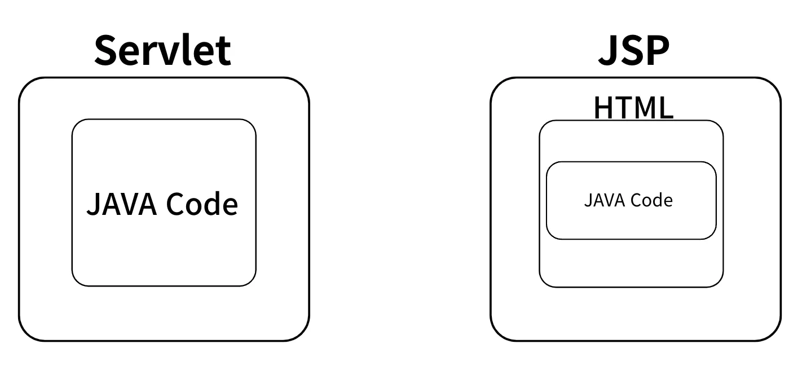

# 2025-03-19
## 내일배움캠프 22일차 TIL

### [ Spring 입문 ]

기초 Spring 1주차
1. 네트워크 (17일 수강완료)
2. Web기초 (17일 수강완료)
3. 용어 모음집 ★(17일 수강완료)
4. HTTP (17일 수강완료)
5. Web Application(18일 수강완료)

기초 Spring 2주차
1. 프레임워크, 라이브러리(18일 수강완료)
2. Annotation(18일 수강완료)
3. Spring Framework, Spring Boot(18일 수강완료)
4. 빌드 관리 도구(18일 수강완료)
5. Java 웹 기술의 역사(18일 수강완료)

기초 Spring 3주차
1. MVC 패턴(19일 수강완료)
2. Spring MVC(19일 수강완료)

<strong>1. MVC 패턴</strong>

1. 대표적인 템플릿 엔진
   1. Thymeleaf  
     - Spring과 통합이 잘 되어있다.  
     - 다양한 기능을 포함하고 있다.
   2. JSP(Java Server Pages)  
     - 예전엔 많이 사용했으나, 현재 안 쓰는 추세

2. MVC 패턴 개요
- Servlet이나 JSP만으로 비지니스 로직과 View Rendering 까지 모두 처리하면 책임이 너무 많아져 고안된 패턴이다. Web Application은 일반적으로 MVC(Model View Controller) 패턴을 사용한다.

3. Servlet 동작 순서 (백엔드 웹 기술의 역사)

  

  

   1. 사용자가 Client(브라우저)를 통해 서버에 HTTP Request 즉, API 요청을 한다.
   2. 요청을 받은 Servlet 컨테이너는 `HttpServletRequest`, `HttpServletResponse`객체를 생성한다.
   3. 설정된 정보(URL, HTTP Method)를 통해 어떠한 Servlet에 대한 요청인지 찾는다.
   4. 해당 Servlet에서 service 메서드를 호출한 뒤 브라우저의 요청 Method에 따라 `doGet()` 혹은`doPost()` 등의 메서드를 호출한다.
   5. 서버에서 응답을 생성한 뒤 `HttpServletResponse`객체에 응답을 담아 Client(브라우저)에 반환한다.
   6. 응답이 완료되면 생성한 `HttpServletRequest`, `HttpServletResponse`객체를 소멸한다.

- Servlet 문제점
    - 화면을 그리는 View 영역과 비지니스 로직이 Servlet 하나에 모두 섞여있다.
    - 책임을 너무 많이 가지고 있다.

- Servlet과 JSP 구조

  

- Servlet, JSP 방식의 문제점
  1. Servlet만을 사용한 경우 View를 위한 코드와 비지니스 로직을 처리하는 코드가 Servlet에 모두 존재하여 유지보수가 어려워진다.
  2. **JSP를 사용하여 View를 분리하였지만** 비지니스 로직의 일부가 JSP 파일안에 존재한다. 여전히 책임이 많아 유지보수가 어렵다.

4. **MVC 패턴**
   - 하나의 Servlet이나 JSP로 처리하던 것들을 Model, View, Controller 영역으로 나눈것이다.
   - 기획이 변하지 않는 이상 비지니스 로직과 View의 수정 원인은 별개로 발생한다.
   - 화면 구성에 수정이 발생하면 View만 변경
   - 요구사항에 수정이 발생하는 경우 비지니스 로직 변경
   - 서로 연관이 없는 코드끼리 함께 존재할 필요가 없어 완전히 분리

   - **Controller**
       - 예시 코드에서 Servlet에 해당하는 영역이다.
       1. HTTP Request를 전달받아 파라미터를 검증한다.
       2. 비지니스 로직을 실행한다.
           - 비지니스 로직 : Service Layer를 별도로 만들어서 처리(Layered Architecture)
           - Database와 상호작용 : Repository Layer를 추가로 구성(Layered Architecture)
           - Controller도 비지니스 로직을 포함할 수 있지만 일반적으로 Service Layer를 호출하는 역할을 담당
       3. View에 전달할 결과를 조회하여 Model 객체에 임시로 저장

   - **Model**
       1. View에 출력할 Data를 저장하는 객체
       2. View는 비지니스 로직이나 Data 접근을 몰라도 되고 View Rendering에만 집중(책임 분리)

   - View
       - 예시 코드에서 JSP에 해당하는 영역
       1. Model 객체에 담겨져 있는 Data를 사용하여 화면을 Rendering

  - MVC 패턴의 문제점
    - MVC 패턴을 적용 후 View의 역할은 필요한 데이터를 Model 에서 참조하여 화면을 그리는 역할만 수행하면 된다. 하지만 Controller에 해당하는 부분은 여전히 문제를 가지고 있다.

<strong>2. Spring MVC</strong>

<strong>포트폴리오 계획(변동없음)</strong>

## 웹
기존에 사용하던 OCI DB서버를 그대로 사용하고, 새로 만들어질 사이트는 현재 포트폴리오가 올라와있는 곳에서 올려보려한다.  
TS를 강의를 통해서 배우긴했지만, 막상 사용해보려하니 까다롭고 번거롭긴하다.  Vite를 이용한 React 프로젝트를 진행하려고 한다.

> 목표 환경  
- 프론트 : (Vite) React + TS / 백엔드 : SpringBoot, MariaDB

## 코테(알고리즘 & SQL)

백준, 프로그래머스 문제를 풀고나면 연동이 되는 백준허브를 설치해서 사용했다.

https://chromewebstore.google.com/detail/ccammcjdkpgjmcpijpahlehmapgmphmk?utm_source=item-share-cb
> 크롬 확장프로그램이며, 설치하고 Git 로그인을 한 후  Repository 명만 등록해주면 문제풀이 하고나서 해당 Repository에 자동으로 등록된다!  

> 문제풀이가 필요한 문제가 생길경우 TIL에 작성할 예정.

https://github.com/SW00Y/learn_CodingTest

## Tomorrow
3주차 강의 듣기