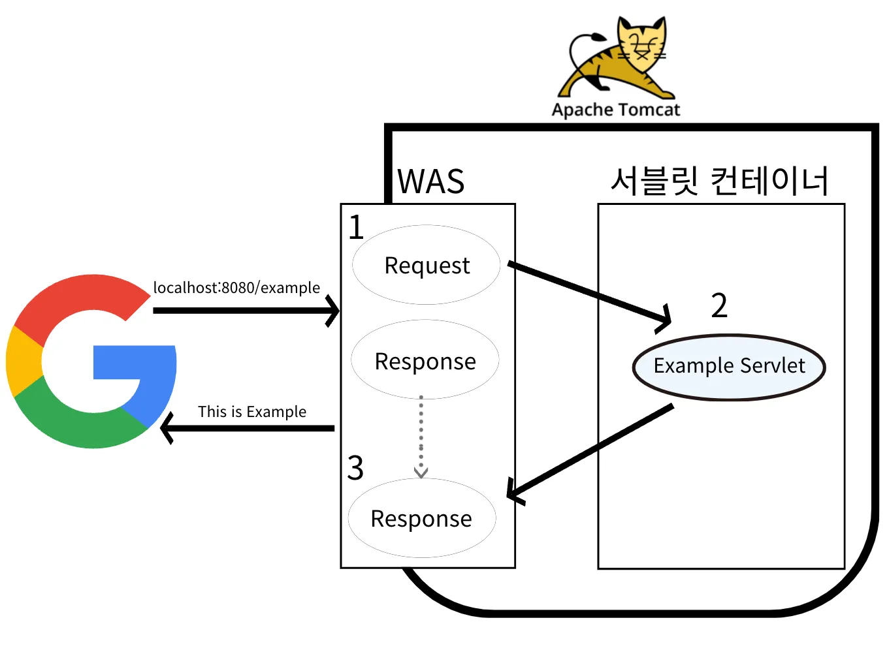
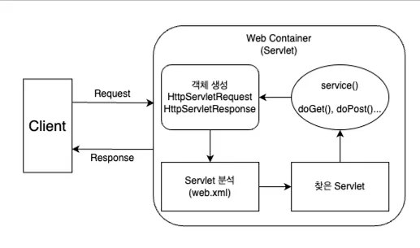
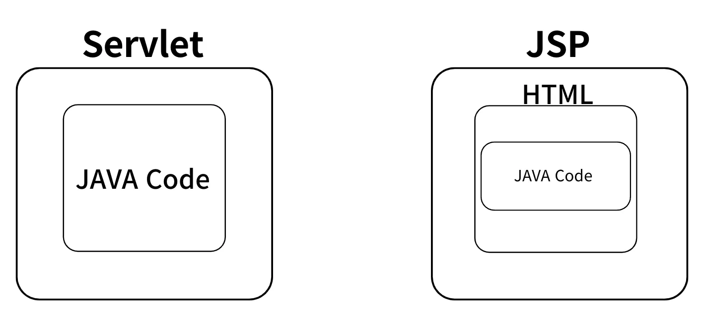

# 2025-03-20~26

### [ Spring 입문 ]

1. MVC 패턴
2. Spring MVC
3. Spring Annotation
4. Spring Request&Response Data
5. Layered Architecture
6. Java & Database
<hr>

<details>

<summary style="font-size: 16px;">
<strong>1. MVC 패턴</strong>
</summary>

1. 대표적인 템플릿 엔진
   1. Thymeleaf  
     - Spring과 통합이 잘 되어있다.  
     - 다양한 기능을 포함하고 있다.
   2. JSP(Java Server Pages)  
     - 예전엔 많이 사용했으나, 현재 안 쓰는 추세

2. MVC 패턴 개요
- Servlet이나 JSP만으로 비지니스 로직과 View Rendering 까지 모두 처리하면 책임이 너무 많아져 고안된 패턴이다. Web Application은 일반적으로 MVC(Model View Controller) 패턴을 사용한다.

3. Servlet 동작 순서 (백엔드 웹 기술의 역사)

  

<hr>

  

   1. 사용자가 Client(브라우저)를 통해 서버에 HTTP Request 즉, API 요청을 한다.
   2. 요청을 받은 Servlet 컨테이너는 `HttpServletRequest`, `HttpServletResponse`객체를 생성한다.
   3. 설정된 정보(URL, HTTP Method)를 통해 어떠한 Servlet에 대한 요청인지 찾는다.
   4. 해당 Servlet에서 service 메서드를 호출한 뒤 브라우저의 요청 Method에 따라 `doGet()` 혹은`doPost()` 등의 메서드를 호출한다.
   5. 서버에서 응답을 생성한 뒤 `HttpServletResponse`객체에 응답을 담아 Client(브라우저)에 반환한다.
   6. 응답이 완료되면 생성한 `HttpServletRequest`, `HttpServletResponse`객체를 소멸한다.

- Servlet 문제점
    - 화면을 그리는 View 영역과 비지니스 로직이 Servlet 하나에 모두 섞여있다.
    - 책임을 너무 많이 가지고 있다.

- Servlet과 JSP 구조

  

- Servlet, JSP 방식의 문제점
  1. Servlet만을 사용한 경우 View를 위한 코드와 비지니스 로직을 처리하는 코드가 Servlet에 모두 존재하여 유지보수가 어려워진다.
  2. **JSP를 사용하여 View를 분리하였지만** 비지니스 로직의 일부가 JSP 파일안에 존재한다. 여전히 책임이 많아 유지보수가 어렵다.


4. **MVC 패턴**
   - 하나의 Servlet이나 JSP로 처리하던 것들을 Model, View, Controller 영역으로 나눈것이다.
   - 기획이 변하지 않는 이상 비지니스 로직과 View의 수정 원인은 별개로 발생한다.
   - 화면 구성에 수정이 발생하면 View만 변경
   - 요구사항에 수정이 발생하는 경우 비지니스 로직 변경
   - 서로 연관이 없는 코드끼리 함께 존재할 필요가 없어 완전히 분리

   - **Controller**
       - 예시 코드에서 Servlet에 해당하는 영역이다.
       1. HTTP Request를 전달받아 파라미터를 검증한다.
       2. 비지니스 로직을 실행한다.
           - 비지니스 로직 : Service Layer를 별도로 만들어서 처리(Layered Architecture)
           - Database와 상호작용 : Repository Layer를 추가로 구성(Layered Architecture)
           - Controller도 비지니스 로직을 포함할 수 있지만 일반적으로 Service Layer를 호출하는 역할을 담당
       3. View에 전달할 결과를 조회하여 Model 객체에 임시로 저장

   - **Model**
       1. View에 출력할 Data를 저장하는 객체
       2. View는 비지니스 로직이나 Data 접근을 몰라도 되고 View Rendering에만 집중(책임 분리)

   - View
       - 예시 코드에서 JSP에 해당하는 영역
       1. Model 객체에 담겨져 있는 Data를 사용하여 화면을 Rendering

  - MVC 패턴의 문제점
    - MVC 패턴을 적용 후 View의 역할은 필요한 데이터를 Model 에서 참조하여 화면을 그리는 역할만 수행하면 된다. 하지만 Controller에 해당하는 부분은 여전히 문제를 가지고 있다.

</details>

<hr>

<details>

<summary style="font-size: 16px;">
<strong>2. Spring MVC</strong>
</summary>


1. Spring MVC 패턴
- Spring MVC는 Spring 프레임워크에서 제공하는 MVC 기반 웹 애플리케이션 개발을 위한 구조로, DispatcherServlet을 중심으로 동작한다.

2. Spring MVC의 주요 컴포넌트
- DispatcherServlet (프론트 컨트롤러)
  - 모든 요청을 받아 적절한 컨트롤러로 전달하는 역할
  - web.xml 또는 Spring Boot 설정에서 자동으로 등록됨

3. Controller (컨트롤러)
- @Controller 또는 @RestController를 사용하여 요청을 처리
- @RequestMapping, @GetMapping, @PostMapping 등을 활용하여 URL을 매핑

4. Model (모델)
- 데이터를 가공하고 저장하는 역할
- @ModelAttribute, @RequestParam 등을 사용하여 데이터를 컨트롤러에서 뷰로 전달

5. View (뷰)
- 클라이언트에게 최종적으로 보여지는 화면
- Thymeleaf, JSP, JSON 응답 등을 통해 결과를 표현

6. ViewResolver
- 컨트롤러에서 반환한 뷰 이름을 실제 뷰 파일(.html, .jsp)로 매핑

7. Spring MVC의 동작 과정
   1. 사용자가 특정 URL 요청
   2. DispatcherServlet이 요청을 받아 HandlerMapping을 통해 적절한 컨트롤러 찾기
   3.  컨트롤러에서 요청을 처리하고 Model 데이터를 생성하여 반환
   4.  ViewResolver가 적절한 뷰를 찾아 렌더링
   5.  최종적으로 사용자에게 응답을 반환
   
8. Spring MVC의 특징
- DispatcherServlet을 중심으로 요청을 처리
- Annotation 기반(@Controller, @RequestMapping 등)으로 유연한 개발 가능
- 다양한 View 기술 지원 (JSP, Thymeleaf, JSON 응답)
- RESTful 웹 서비스 개발이 용이함

9. 일반 MVC 패턴 vs Spring MVC 패턴 비교

| 구분           | 일반 MVC 패턴                         | Spring MVC 패턴                             |
|----------------|---------------------------------------|--------------------------------------------|
| 프론트 컨트롤러 | 없음 (요청마다 개별 컨트롤러 실행)    | DispatcherServlet이 모든 요청을 처리     |
| 요청 처리 방식 | 컨트롤러가 직접 Model, View 연결      | HandlerMapping을 통해 적절한 컨트롤러 찾음|
| 뷰 처리 방식   | JSP, HTML, JavaScript 등             | Thymeleaf, JSP, JSON 응답 가능            |
| 데이터 전달 방식 | 컨트롤러에서 직접 데이터 전달        | Model, @RequestParam, @ModelAttribute 사용|
| 비즈니스 로직   | 컨트롤러 내부에서 직접 수행 가능     | Service, DAO 등으로 계층 분리            |

10. 정리
- MVC 패턴은 애플리케이션을 Model, View, Controller로 나누어 구조화하는 방식
- Spring MVC는 Spring 프레임워크에서 MVC 패턴을 구현한 것으로, DispatcherServlet을 중심으로 동작
- Controller에서 요청을 처리하고, Model을 통해 데이터를 전달하며, ViewResolver를 통해 뷰를 결정
- RESTful API를 구현할 때는 @RestController를 사용하여 JSON 응답을 반환

</details>

<hr>


<details>

<summary style="font-size: 16px;">
<strong>3. Spring Annotation</strong>
</summary>

1. `로깅`과 `@Slf4j`
- Lombok의 @Slf4j는 로깅을 위한 인터페이스로, 구현체로 Logback을 주로 사용
- 로그 레벨: TRACE > DEBUG > INFO > WARN > ERROR
- 운영 환경에서는 system.out.println() 대신 로깅 라이브러리 사용

2. `@Controller`, `@RestController`
- @Controller : View 반환에 사용 (Thymeleaf, JSP 등 템플릿 엔진과 함께 사용)
- @RestController : 데이터 반환에 사용 (HTTP Body에 직접 데이터 작성)

3. 주요 `어노테이션`
- @Component : Spring Bean 등록
- @Target : 애노테이션이 적용될 대상 지정
- @Retention : 애노테이션 정보 유지 기간 설정
- @Documented : Javadoc에 문서화 포함

4. Request Mapping
- @RequestMapping : URL과 메서드 매핑 (클래스와 메서드 레벨 모두 적용 가능)
- @GetMapping, @PostMapping, @PutMapping, @DeleteMapping, @PatchMapping : HTTP 메서드별 축약형
- @PathVariable : URL 경로 변수 사용
- params : 특정 파라미터 조건 설정
- headers : 특정 헤더 조건 설정

  | 작업       | HTTP 메서드 | URL 패턴                  |
  |------------|-------------|--------------------------|
  | 전체 조회   | GET         | `/posts`                 |
  | 단건 조회   | GET         | `/posts/{id}`            |
  | 생성       | POST        | `/posts`                 |
  | 전체 수정   | PUT         | `/posts/{id}`            |
  | 삭제       | DELETE      | `/posts/{id}`            |

</details>

<hr>

<details>

<summary style="font-size: 16px;">
<strong>4. Spring Request&Response Data</strong>
</summary>

 1. HTTP 요청 데이터 처리 방식
- Query Parameter (GET)
  - URL 뒤 `?key=value` 형태로 전달
  - `@RequestParam`으로 접근
  - 필수 파라미터 설정: `@RequestParam(required=true)`
  - 기본값 설정: `@RequestParam(defaultValue="guest")`

- Form Data (POST)
  - `x-www-form-urlencoded` 형식
  - `@ModelAttribute`로 객체 자동 바인딩
  - 주의: 필드명과 파라미터명 일치해야 함

- HTTP Body (JSON)
  - REST API에서 주로 사용
  - `@RequestBody`로 객체 변환
  - 반드시 `Content-Type: application/json` 설정 필요

2. 주요 어노테이션
- @ModelAttribute
  - Form 데이터 → 객체 매핑
  - Setter 기반 바인딩
  - 생략 가능 (단, 객체 타입인 경우)

- @RequestBody
  - JSON → 객체 매핑
  - `HttpMessageConverter`가 처리
  - 생략 불가능 (생략 시 `@ModelAttribute` 적용됨)

3. HTTP 응답 핵심
- ResponseEntity
  - 상태 코드, 헤더, 바디 모두 제어 가능
  - 예: `return ResponseEntity.status(201).body(data);`

- @ResponseBody
- 반환 값을 HTTP Body에 직접 작성
- `@RestController` 사용 시 자동 적용

4. 주의

   1. 타입 불일치  
   - Form 데이터에서 `age=abc` 전송 시 `BindException` 발생 → 검증(Validation) 필요

   1. JSON 처리  
   - 요청/응답 모두 `Content-Type: application/json` 필수
   - 기본적으로 Jackson 라이브러리 사용

   1. 파라미터 생략  
   - `@RequestParam` 생략 시 `required=false`로 동작 → 명시적 작성 권장

</details>

<hr>

<details>

<summary style="font-size: 16px;">
<strong>5. Layered Architecture</strong>
</summary>

1. Layered Architecture

- 계층 구조와 역할

  | 계층                  | 주요 기능                                                                 | 사용 컴포넌트                |
  |-----------------------|--------------------------------------------------------------------------|-----------------------------|
  | **Presentation**      | - 사용자 요청 처리<br>- API/View 응답                                    | Controller                 |
  | **Business (Service)**| - 비즈니스 로직 처리<br>- 트랜잭션 관리                                  | Service                    |
  | **Data Access**       | - DB 연동<br>- CRUD 작업 수행                                           | Repository (DAO)           |

2. 계층 간 데이터 흐름
클라이언트 → Controller → Service → Repository → DB  
↓
클라이언트 ← DTO/View ← Service ←

3. 장점
- 관심사 분리 : 각 계층은 단일 책임 원칙 적용
- 유지보수성 : 기능 변경 시 해당 계층만 수정
- 테스트 용이 : 계층별 독립적 테스트 가능

</details>

<hr>

<details>

<summary style="font-size: 16px;">
<strong>6. Java & Database</strong>
</summary>

1. JDBC 주요 개념

    | 구성 요소             | 설명                                                                     |
    |-----------------------|--------------------------------------------------------------------------|
    | **Connection**        | DB 연결 세션 관리                                                       |
    | **Statement**         | 정적 SQL 실행 (보안 취약)                                                |
    | **PreparedStatement** | 파라미터 바인딩 지원 (SQL Injection 방어)                                |
    | **ResultSet**         | 쿼리 결과를 객체로 매핑                                                  |

2. SQL Injection 방어
    ```java
    // 취약한 방식 (Statement)
    String query = "SELECT * FROM users WHERE id = " + userInput;

    // 안전한 방식 (PreparedStatement)
    String query = "SELECT * FROM users WHERE id = ?";
    PreparedStatement pstmt = connection.prepareStatement(query);
    pstmt.setString(1, userInput);
    ```

3. 트랜잭션 관리
    ```java
    connection.setAutoCommit(false);  // 트랜잭션 시작
    try {
        accountDAO.withdraw(sender, amount);
        accountDAO.deposit(receiver, amount);
        connection.commit();  // 성공 시 커밋
    } catch (SQLException e) {
        connection.rollback();  // 실패 시 롤백
    }
    ```

4. DB 설계 핵심
- 정규화 : 데이터 중복 최소화 (1NF, 2NF, 3NF)
- 인덱스 : 검색 성능 향상 (BUT 과도한 인덱스는 쓰기 성능 저하)
- ACID : 원자성(Atomicity), 일관성(Consistency), 격리성(Isolation), 지속성(Durability)

5. 팁
   1. 계층 분리 원칙
      - Controller: HTTP 요청/응답 처리만 담당
      - Service: @Transactional로 트랜잭션 관리
      - Repository: 순수한 DB 접근 로직

   2. 성능 최적화
      - Connection Pool 사용 (HikariCP 등)
      - Batch Insert/Update 처리
      - 불필요한 조회 최소화

   3. 보안 강화
      - 모든 사용자 입력값 검증(Validation)
      - PreparedStatement 100% 활용
      - 에러 메시지 노출 제한

</detail>
